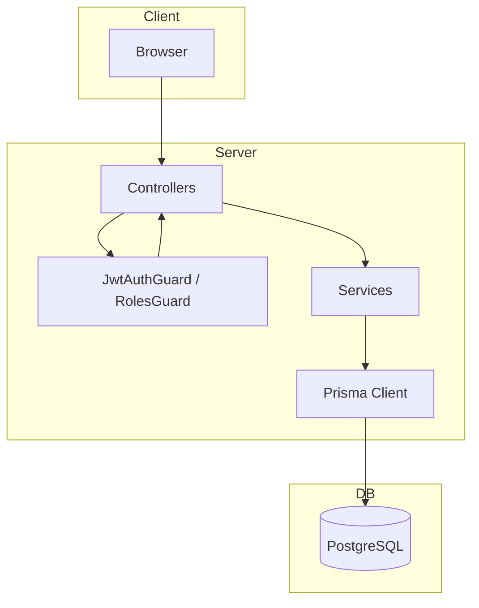

# Server — Architecture

## High-level

## Request flow

1. Request hits Nest controller (route).
2. Guards: JwtAuthGuard (where applied) validates JWT; RolesGuard checks role (e.g. HR/ADMIN).
3. Controller calls service method(s); DTOs validated by ValidationPipe (whitelist, forbidNonWhitelisted, transform).
4. Service uses Prisma for DB; returns DTOs or entities.
5. Optional: transform interceptor (if used). *How to verify:* [../../server/src/common](../../server/src/common).

## Error handling

- ValidationPipe throws on invalid body/query.
- Unauthorized: guard returns 401.
- Controllers/services throw Nest HTTP exceptions where needed; Nest sends appropriate status. No global exception filter documented. *How to verify:* grep for `HttpException` / `@Catch` in server/src.

## Config

- Env: PORT, DATABASE_URL, JWT_* in .env; no Nest ConfigModule pattern required for current usage.
- Constants: e.g. [../../server/src/config/career-scenarios.constants.ts](../../server/src/config/career-scenarios.constants.ts), recommendations.constants.ts — used by services.

## Performance

- Career graph built in memory in career-paths/career-recommendations services; no caching documented. *How to verify:* search for "cache" in server/src.
